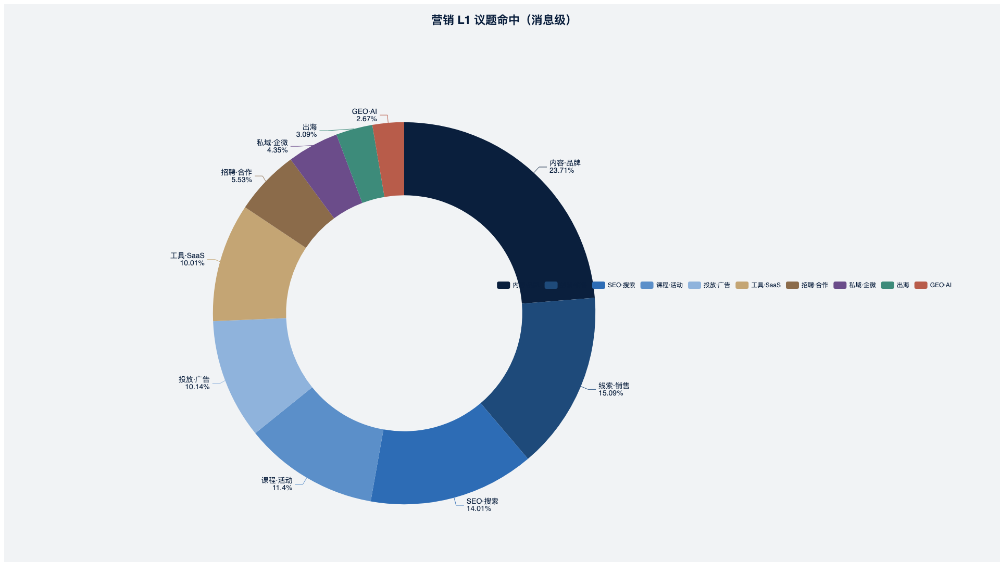

# 03 · 图表规范与清单

**数据底稿：** 342,260 条（2021-04-18 — 2026-05-15）· 七班全量  
**图片目录：** `assets/charts/` · **原始表：** `assets/data/`  
**GitHub 图床：** 推送仓库后使用 `https://raw.githubusercontent.com/<user>/<repo>/main/assets/charts/<id>.png`

---

## 制图原则

| 原则 | 说明 |
|------|------|
| 主标题写结论 | 图题 / 幻灯片大标题 = 「超过 X 条…」「占全群 Y%」；不写「总结：」 |
| 结构放二级 | `### 第二篇 · 2.4 渠道与平台` 标明白皮书位置 |
| 占比 vs 绝对值 | **年度结构变化**用 100% 堆叠柱 / **占比桑基**；**体量变化**用柱状/折线（消息量、命中条数） |
| 桑基图 | 每一「年份列」节点权重之和 = **100%**（仅营销 L1 十类，互斥口径）；连线表示议题在相邻年份的**占比延续**，不看绝对条数递减 |
| 配色 | 靛蓝系 `#0a1f3d` → `#5b8fc9` + 强调色 `#c4a574`（GEO/拐点） |
| 尺寸 | 导出 **1920×1080** PNG，透明底关闭，白底 `#f1f3f5` |

---

## 图表总表（22 张）

| ID | 类型 | 文件名 | 主结论标题（MD / PPT 用） | 篇章 |
|----|------|--------|---------------------------|------|
| C01 | 环形饼图 | `c01-msg-type.png` | 文本消息占全群 **73.2%**（250,605 条） | 第一篇 · 组织 |
| C02 | 环形饼图 | `c02-groups.png` | **5/2/1 班**承载约 **68%** 消息量 | 第一篇 · 组织 |
| C03 | 环形饼图 | `c03-speaker-tier.png` | **42%** 发言者仅发 1—9 条（围观层 734 人） | 第一篇 · 组织 |
| C04 | 柱状图 | `c04-year-volume.png` | 年消息量 **2021 峰值 8.0 万**，2025 回落至 **3.6 万** | 第二篇 · 五年 |
| C05 | 柱状图 | `c05-month-top15.png` | 单月峰值 **2021-08：17,878 条** | 第二篇 · 五年 |
| C06 | 柱状图 | `c06-quarter-top12.png` | 最热季度 **2021-Q3：36,581 条** | 第二篇 · 五年 |
| C07 | 分组柱状 | `c07-halfyear.png` | 2021H2、2023H2 为两个「半年爆发段」 | 第二篇 · 五年 |
| C08 | 100% 堆叠柱 | `c08-l1-share-year.png` | **2026 年 GEO 占营销议题 19.1%**，首超线索（8.8%） | 第二篇 · 议题 |
| C09 | **占比桑基图** | `c09-l1-sankey-share.png` | 议题结构五年迁移：GEO 从可忽略到近 **两成** | 第二篇 · 议题 |
| C10 | 折线图 | `c10-l1-trend-abs.png` | 线索/SEO 命中绝对值随群总量下降，但 2022—2023 仍双峰 | 第二篇 · 议题 |
| C11 | 环形饼图 | `c11-l1-all.png` | 营销议题命中 **内容品牌 22,833** 最高（占全群 6.7%） | 第四篇 · 议题 |
| C12 | 环形饼图 | `c12-industry.png` | **6,549 条**提及 SaaS/企业服务，为行业第一 | 核心数据 · 行业 |
| C13 | 100% 堆叠柱 | `c13-industry-share-year.png` | **出海**提及占比在 2025—2026 逆势升高 | 核心数据 · 行业 |
| C14 | 环形饼图 | `c14-pain.png` | **2,045 条**命中 SEO/收录类痛点，五年最高 | 核心数据 · 痛点 |
| C15 | 100% 堆叠柱 | `c15-pain-share-year.png` | **2025 起 GEO/AI 焦虑**占痛点结构第一 | 核心数据 · 痛点 |
| C16 | 折线图 | `c16-pain-trend.png` | 销售互怼痛点 2022—2023 最集中 | 核心数据 · 痛点 |
| C17 | 柱状图 | `c17-speakers-top10.png` | 赵岩 **52,960 条（15.5%）**，Zhaoy07331、始熊君分列二三 | 第三篇 · 参与者 |
| C18 | 柱状图 | `c18-hours.png` | **10—11 时**为发言高峰（合计约 9.6 万条） | 第一篇 · 活跃 |
| C19 | 柱状图 | `c19-silence-by-class.png` | **7 班沉默率 81.3%**，不宜与 1—5 班比活跃度 | 第一篇 · 组织 |
| C20 | 折线图 | `c20-zhao-by-year.png` | 赵岩发言 2023 峰值 **12,849 条/年** | 第三篇 · 赵岩 |
| C21 | 柱状图 | `c21-platform-l2.png` | 百度提及 **5,629**；2026 GEO 标签 **265 条/年** | 第二篇 · 渠道 |
| C22 | 对比条 | `c22-geo-vs-lead-2026.png` | **2026 年 GEO-AI 命中 622 条，约为线索 287 条的 2.2 倍** | 第二篇 · 2026 |

---

## 桑基图（C09）专项说明

- **节点：** `21·线索`、`21·SEO` … `26·GEO`（营销 L1 十类 × 6 年）
- **节点值：** 该年该议题命中数 ÷ **当年营销 L1 总命中** × 100（每年列合计 100%）
- **连线：** 同年议题 → 次年同议题，流量 = **次年该议题占比**（强调结构流入，非保留绝对量）
- **读图：** 列高始终一致；带宽变化 = **占比变化**；GEO 列 2025—2026 明显变宽

---

## MD 嵌入格式

```markdown
## 超过 14,529 条消息命中「线索 · 销售」议题（占全群 4.2%）

### 第四篇 · 4.1 线索 · 销售 · 转化



| 指标 | 数值 |
|------|------|
| … | … |

*原始数据：* `assets/data/l1-topics.json`
```

---

## PPT 页型（约 48 页）

| 页型 | 数量 | 说明 |
|------|------|------|
| 封面 / 幕封 | 6 | Act 0—VI |
| 结论 + 单图 | 22 | 与 C01—C22 一一对应 |
| 结论 + 数据表 | 12 | 大表拆 2 页：上总结、下表格 |
| 原话 | 4 | 第六篇精选 |
| 收尾 | 2 | |

---

*生成脚本：`export_all_charts.py` · 重建 PPT：`gen_deck_full.py`*
